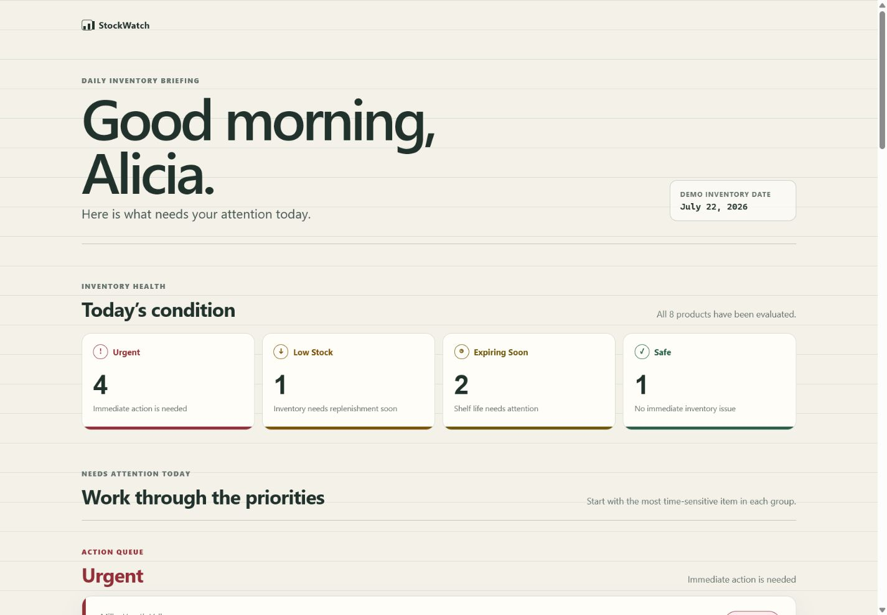
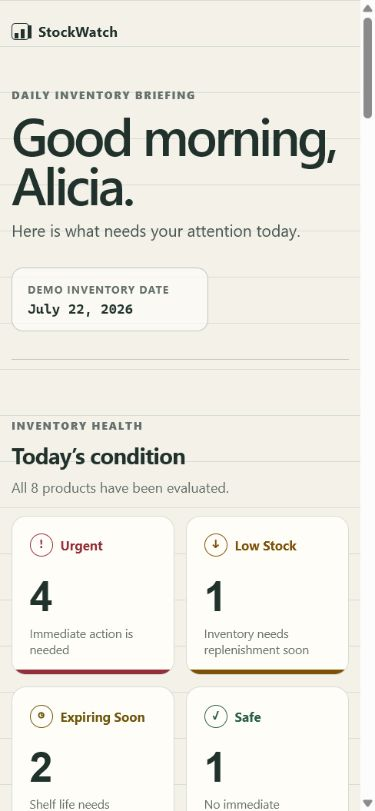
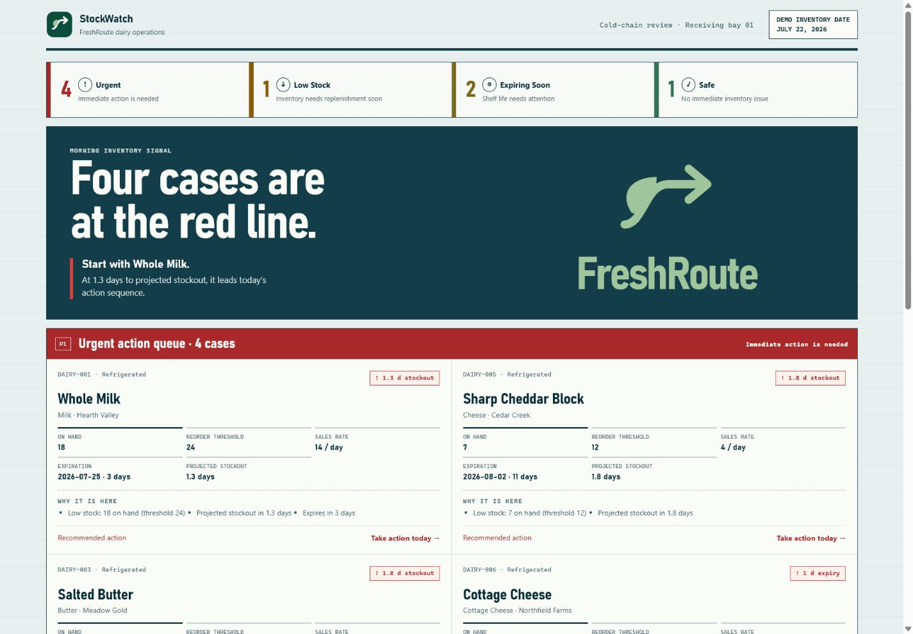
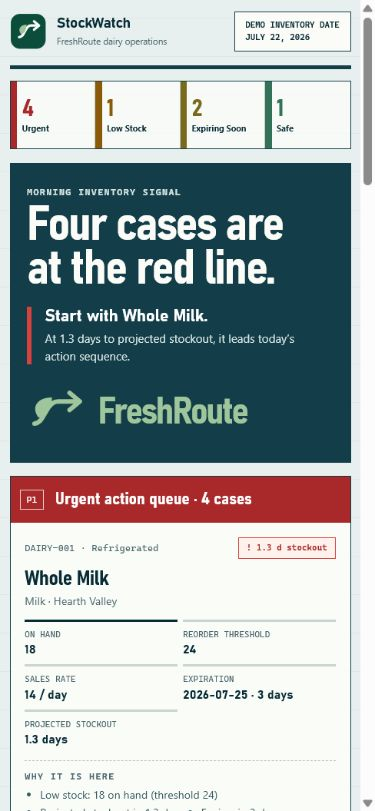

# StockWatch

StockWatch is an inventory attention dashboard designed to help Inventory Coordinators quickly identify which products need action.

Instead of manually reviewing every row in a spreadsheet, the user can open StockWatch and immediately see products that are low in stock, expiring soon, or urgent.

## Problem Statement

An Inventory Coordinator struggles to quickly identify which products need attention each day because the current spreadsheet does not automatically compare stock quantities, reorder thresholds, sales rates, and expiration dates, which means products may run out or expire before action is taken.

## Solution

StockWatch reviews inventory information and organizes products into clear alert categories.

The dashboard helps the Inventory Coordinator answer one important question:

What products need my attention today?

StockWatch provides information and recommended actions, but the MVP does not automatically place orders, contact suppliers, or generate reports.

## Core MVP Features

- View a summary of inventory alerts
- Identify low-stock products
- Identify products expiring soon
- Highlight urgent products
- Filter products by alert category
- View individual product details
- Display recommended actions
- Mark products as reviewed

## MVP User Flow

Open Inventory Dashboard
→ View Today’s Inventory Summary
→ Select an Alert Category
→ Review Flagged Products
→ Open a Product for Details
→ Review the Recommended Action
→ Mark the Product as Reviewed

After a product is marked as reviewed, the StockWatch MVP flow ends. The Inventory Coordinator completes actions such as placing an order through the company’s existing process.

## MVP Scope

Included:

- Sample inventory data
- Inventory priority calculations
- Alert categories
- Product filtering
- Product details
- Display-only recommendations
- Reviewed status

Not included:

- Automatic supplier orders
- Supplier emails
- Report generation
- User accounts
- Multiple warehouses
- Live database connections
- Advanced sales forecasting

## Tech Stack

- HTML
- CSS
- JavaScript
- Git
- GitHub

## Project Status

The first StockWatch inventory-prioritization dashboard is implemented. It evaluates the eight-product sample inventory and presents the approved Urgent, Low Stock, Expiring Soon, and Safe priorities.

## Design evolution

The current interface is **V2 · Cold-Chain Signal Board**. The earlier Field Desk and Cold-Chain studies are retained in `docs/screenshots/` as explorations, while the numbered history tracks released dashboard versions.

| Version | Desktop | Mobile |
| --- | --- | --- |
| V1 · Original daily briefing |  |  |
| **V2 · Cold-Chain Signal Board (current)** |  |  |

## V2.1 CSV inventory loader

StockWatch V2.1 opens with an empty inventory board. Choose a local CSV file and StockWatch keeps it only for the current browser session:

```text
CSV file selected
→ parsed and validated
→ evaluated
→ dashboard updated
→ reset returns to empty state
```

The import accepts these required columns: `productName`, `category`, `brand`, `quantityOnHand`, `reorderThreshold`, `salesRatePerDay`, and `expirationDate`. It also supports optional `id` and `storageCondition` columns. Imported inventory is temporary: refreshing the page or clearing inventory returns StockWatch to its empty state.

Demo CSV files in `data/demo-csv/` demonstrate the importer:

- `balanced-inventory.csv` — one Low Stock, one Expiring Soon, and four Safe products.
- `high-urgency-inventory.csv` — four Urgent products plus one Low Stock and one Expiring Soon product.
- `expiration-heavy-inventory.csv` — five healthy-stock products expiring soon and one Safe product.
- `all-safe-inventory.csv` — six Safe products.
- `invalid-inventory.csv` — validation errors that leave the existing dashboard unchanged.

