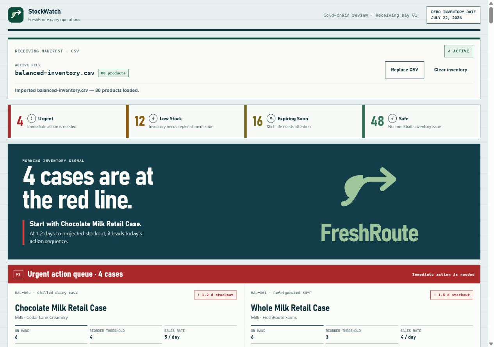

# StockWatch

StockWatch helps inventory coordinators quickly identify products that are urgent, running low, or nearing expiration so they can decide what needs attention first.

> **[Open the live StockWatch MVP](https://ojayc-pursuit.github.io/stock-watch/)**



## The story behind StockWatch

Alicia is an Inventory Coordinator at FreshRoute, a dairy distributor. She manages more than 80 refrigerated products, but her inventory information is spread across manually updated spreadsheets. Comparing quantities, sales rates, reorder thresholds, and expiration dates takes time, so it is easy to miss a product that may run out or expire.

StockWatch turns that inventory into a prioritized dashboard. Instead of searching through rows, Alicia can immediately see what needs attention and decide where to start.

## The problem

Inventory is tracked manually across spreadsheets, making important information difficult to compare. Low-stock and expiration risks can be missed while the coordinator spends time reviewing rows before deciding what action to take.

## The solution

StockWatch reviews the full inventory and groups products into Urgent, Low Stock, Expiring Soon, and Safe. It explains why each item received its status and provides a display-only recommended action, helping the coordinator decide what to address first.

For this MVP, a CSV file is the way inventory enters the dashboard.

## MVP user flow

```text
Open StockWatch
→ Load an inventory CSV
→ StockWatch validates and evaluates every product
→ Dashboard prioritizes the inventory
→ Coordinator reviews reasons and recommended actions
→ Coordinator decides what action to take
```

## What the MVP demonstrates

StockWatch turns a large inventory file into a clear priority board, helping the coordinator identify urgent, low-stock, and expiring products within seconds.

The included demo files each contain 80 products, reflecting the size of Alicia’s real workflow.

## Current MVP

- CSV inventory loading for up to 250 products
- All-or-nothing validation
- Urgent, Low Stock, Expiring Soon, and Safe calculations
- Summary counts and a dynamic headline
- Reasons and recommended actions for each product
- Replacement imports and clear inventory
- Responsive desktop and mobile layout

## Try the demo

Use the files in [data/demo-csv](data/demo-csv/) to explore different inventory situations:

- `balanced-inventory.csv` — a mixed but manageable day.
- `high-urgency-inventory.csv` — immediate operational risk.
- `expiration-heavy-inventory.csv` — shelf-life pressure with healthy stock.
- `all-safe-inventory.csv` — healthy inventory with no immediate issues.
- `invalid-inventory.csv` — validation errors that preserve the current dashboard.

## CSV format

<details>
<summary>Supported columns, limits, and validation rules</summary>

StockWatch accepts a local `.csv` file. Supported header names are case-sensitive after trimming whitespace; they may appear in any order.

| Column | Required? | Rule |
| --- | --- | --- |
| `productName` | Yes | Nonblank text |
| `category` | Yes | Nonblank text |
| `brand` | Yes | Nonblank text |
| `quantityOnHand` | Yes | Finite number greater than or equal to zero |
| `reorderThreshold` | Yes | Finite number greater than or equal to zero |
| `salesRatePerDay` | Yes | Finite number greater than or equal to zero |
| `expirationDate` | Yes | A real date in exact `YYYY-MM-DD` format |
| `id` | No | Nonblank supplied IDs must be unique; blank or missing IDs receive a temporary in-memory ID |
| `storageCondition` | No | Blank or missing values become `Not specified` |

- Files must be `.csv` and no larger than 1 MB.
- A file can contain at most 250 product rows.
- Validation is all-or-nothing: one invalid required value rejects the complete import.
- Imported data exists only for the current browser session.
- A failed replacement import preserves the active dashboard and active filename.
- Clearing inventory returns StockWatch to its empty state; it does not restore sample data.

### Demo file verification details

| File | Expected status totals | Expected headline |
| --- | --- | --- |
| `balanced-inventory.csv` | 4 Urgent · 12 Low Stock · 16 Expiring Soon · 48 Safe | 4 cases are at the red line. |
| `high-urgency-inventory.csv` | 45 Urgent · 10 Low Stock · 10 Expiring Soon · 15 Safe | 45 cases are at the red line. |
| `expiration-heavy-inventory.csv` | 0 Urgent · 0 Low Stock · 60 Expiring Soon · 20 Safe | 60 products need attention today. |
| `all-safe-inventory.csv` | 0 Urgent · 0 Low Stock · 0 Expiring Soon · 80 Safe | Inventory is clear for today. |
| `invalid-inventory.csv` | No import | The active dashboard stays unchanged. |

</details>

## Technical overview

- Plain HTML, CSS, and JavaScript
- Browser File APIs for local CSV reading
- No backend or database
- Automated Node and browser tests

## Design history

The image above represents the current StockWatch MVP. Earlier [V1 and visual exploration screenshots](docs/screenshots/) are retained as design history only, not as separate current product versions.

